# Lead Processing Sequence Diagram

This diagram shows the complete flow of an email lead from ingestion to database persistence.

```mermaid
sequenceDiagram
    autonumber
    
    participant Sender as 📧 Email Sender
    participant AgentMail as 📬 AgentMail
    participant Backend as 🖥️ Backend (NestJS)
    participant Temporal as ⚙️ Temporal Server
    participant Worker as 👷 Temporal Worker
    participant LangSmith as 🧠 LangSmith
    participant OpenAI as 🤖 OpenAI
    participant DB as 🗄️ PostgreSQL

    %% Email ingestion
    Sender->>AgentMail: Send email to inbox@agentmail.to
    Note over AgentMail: Email received and parsed
    
    AgentMail->>Backend: POST /emails/agentmail<br/>(webhook with message payload)
    
    %% Backend processing
    activate Backend
    Backend->>Backend: Validate payload (Zod schema)
    Backend->>Backend: Extract message fields
    
    %% Start Temporal workflow
    Backend->>Temporal: workflow.start('processLeadWorkflow', input)
    activate Temporal
    Temporal-->>Backend: WorkflowHandle { workflowId, runId }
    Backend-->>AgentMail: 200 OK { workflowId }
    deactivate Backend
    
    %% Temporal dispatches to worker
    Temporal->>Worker: Dispatch workflow task
    activate Worker
    Note over Worker: processLeadWorkflow starts
    
    %% Activity 1: Pull prompt from LangSmith
    Worker->>Worker: Schedule pullAndFormatPrompt activity
    Worker->>LangSmith: hub.pull('cameron121/broccoli-leads')
    activate LangSmith
    LangSmith-->>Worker: ChatPromptTemplate
    deactivate LangSmith
    Worker->>Worker: Format prompt with question
    
    %% Activity 2: Call OpenAI
    Worker->>Worker: Schedule callOpenAICompletion activity
    Worker->>OpenAI: chat.completions.create()
    activate OpenAI
    Note over OpenAI: Extract lead info from email
    OpenAI-->>Worker: { phone, address, service, ... }
    deactivate OpenAI
    
    Worker->>Worker: Parse JSON response
    
    %% Activity 3: Save to database
    Worker->>Worker: Schedule saveLead activity
    Worker->>DB: INSERT INTO broccoli.leads
    activate DB
    DB-->>Worker: { id: 'uuid' }
    deactivate DB
    
    %% Workflow complete
    Worker->>Temporal: Workflow completed
    deactivate Worker
    Note over Temporal: Workflow marked as COMPLETED
    deactivate Temporal
```



## Sequence Breakdown

### Phase 1: Email Ingestion (Steps 1-2)
The sender emails an inbox managed by AgentMail. AgentMail parses the email and fires a webhook to our backend with the structured message data.

### Phase 2: Backend Handling (Steps 3-6)
The backend validates the incoming payload, extracts relevant fields, and immediately starts a Temporal workflow. **The backend does not wait for processing to complete**—it returns as soon as the workflow is queued.

### Phase 3: Workflow Execution (Steps 7-16)
Temporal dispatches the workflow to an available worker. The workflow executes three activities in sequence:

1. **pullAndFormatPrompt** — Fetches a prompt template from LangSmith and formats it with the email content
2. **callOpenAICompletion** — Sends the formatted prompt to OpenAI to extract structured lead data
3. **saveLead** — Persists the extracted lead to PostgreSQL

### Phase 4: Completion (Steps 17)
Once all activities complete successfully, Temporal marks the workflow as COMPLETED. The full execution history is available for debugging and auditing.

---

## Error Handling

Each activity has built-in retry logic (default: 3 attempts with backoff):

```
┌─────────────────────────────────────────────────────────────┐
│                    Activity Retry Flow                       │
├─────────────────────────────────────────────────────────────┤
│                                                             │
│   Attempt 1 ──▶ Fail ──▶ Wait 1s ──▶ Attempt 2 ──▶ Fail    │
│                                           │                 │
│                                           ▼                 │
│                                      Wait 2s               │
│                                           │                 │
│                                           ▼                 │
│                                      Attempt 3 ──▶ Success  │
│                                                             │
└─────────────────────────────────────────────────────────────┘
```

If all retries fail, the workflow fails and can be manually retried or investigated via the Temporal UI.

---

## Viewing Workflow Status

With Temporal running, open the Temporal Web UI at `http://localhost:8080` to:
- See all running and completed workflows
- Inspect individual workflow execution history
- Retry failed workflows
- View activity inputs/outputs

